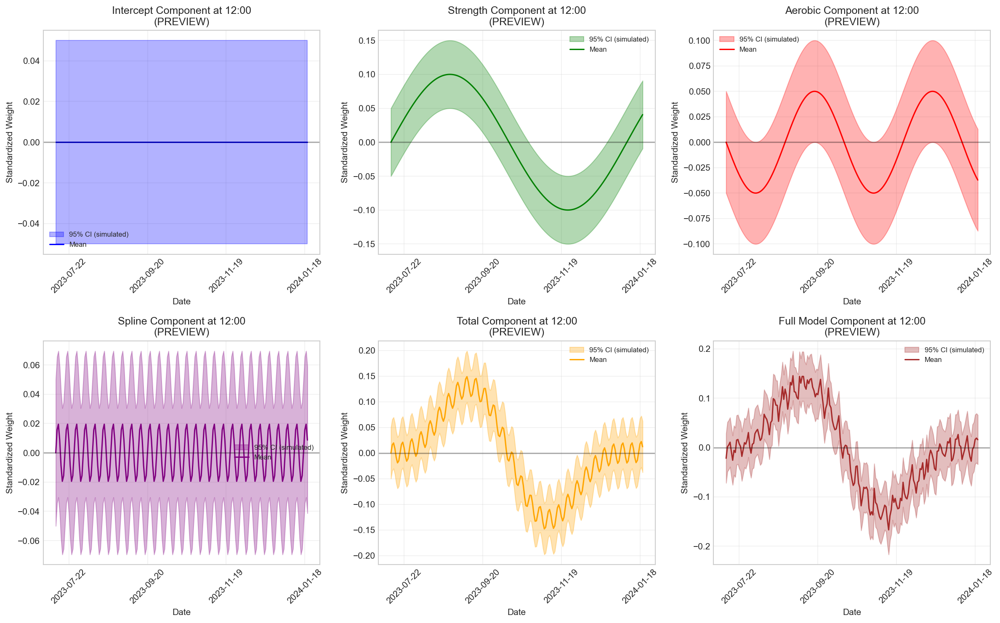
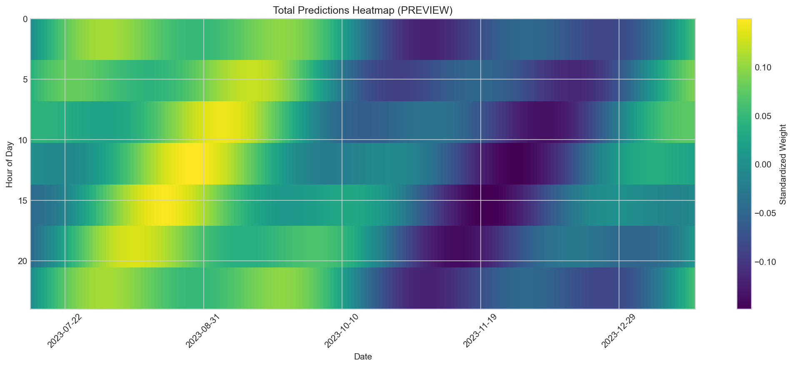
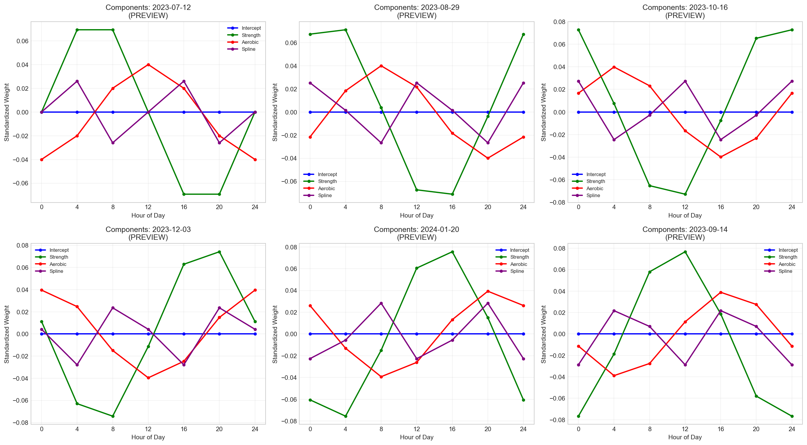

# Component Visualization Previews

Generated: 2026-03-04 20:38:20

## Note

These are **preview plots** showing what the actual visualizations will look like.
The actual plots will be generated from the fitted model with real posterior predictions.

## Preview Plots Generated

### 1. Component Time Series at Noon

- Shows each component's contribution over time at 12:00
- Includes simulated 95% credible intervals
- 6 components: Intercept, Strength, Aerobic, Spline, Total, Full Model

### 2. Total Predictions Heatmap

- Shows total predictions across time (x-axis) and hours (y-axis)
- Color represents standardized weight value
- Reveals daily and longer-term patterns

### 3. Component Contributions at Sample Dates

- Shows how each component varies through the day
- 6 sample dates across the time range
- Reveals daily patterns in each component

## Actual Plots Coming Soon

The full model is currently running and will generate:
1. **Actual posterior predictions** with real credible intervals
2. **CSV files** with component predictions at each hour
3. **Detailed visualizations** based on the fitted model
4. **Summary statistics** and analysis
